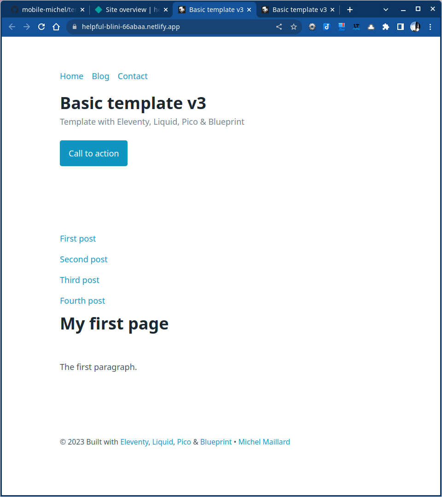

# Template 3

## Template with Eleventy, Liquid, Pico & Blueprint

1. Installation
2. Layout with global data
3. Install Pico.css
4. Create two pages for primary level + 404 page
5. Push to GitHub & deploy to Eleventy

